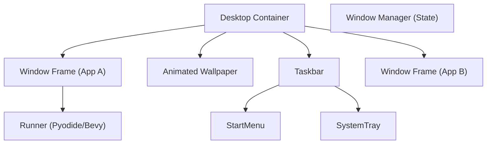

# BobuOS: Architecture & State Management

## The Window Subsystem
The core of BobuOS is a robust React state management system for windows.

### Window State Schema
```typescript
interface BobuWindow {
  id: string;
  title: string;
  type: 'python-game' | 'rust-game' | 'terminal' | 'settings' | 'about';
  content: React.ReactNode;
  icon: string;
  
  // Layout
  x: number;
  y: number;
  width: number;
  height: number;
  
  // Status
  isMinimized: boolean;
  isMaximized: boolean;
  isFocused: boolean;
  zIndex: number;
}
```

### The Window Manager (Context API)
A `BobuOSProvider` will manage the window stack:
- `openWindow(appConfig)`: Creates a new window or brings an existing one to focus.
- `closeWindow(id)`: Removes the window and cleans up associated WASM resources if necessary.
- `focusWindow(id)`: Updates z-indices globally.

## WASM Runtime Management
Unlike a standard webpage where you run one project, BobuOS might run several.

### Shared Bootstrapping
- **Pyodide Management**: A singleton worker to handle Python execution across multiple windows to save memory.
- **Resource Limiting**: Automatic pausing of WASM cycles when a window is minimized or not in focus.

## Component Hierarchy

